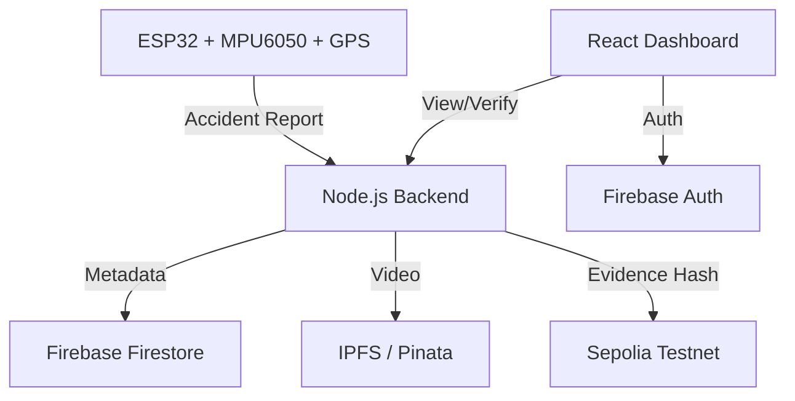

# EvidenceChain: Blockchain-Based Forensic Evidence Management

EvidenceChain is an autonomous, tamper-proof forensic evidence pipeline designed for vehicular accidents. It leverages IoT sensors for collision detection, IPFS for decentralized storage, and Ethereum-compatible blockchains for immutable evidence anchoring.

## 🚀 Key Features
- **Autonomous Detection**: ESP32 with MPU6050 accelerometer detects impacts in real-time.
- **Decentralized Storage**: Forensic video windows (60s) are hashed and uploaded to IPFS via Pinata.
- **Blockchain Anchoring**: Evidence hashes and metadata are anchored to the Sepolia Testnet for tamper-proof verification.
- **Interactive Dashboard**: Investigator dashboard for real-time tracking, accident mapping, and integrity verification.
- **Zero-Trust Security**: Firebase-powered role-based access control.

---

## 🏗️ Architecture


---

## ⚡ Quick Start: No Hardware? No Problem!
**Don't have the ESP32 sensors?** You can still trigger the entire forensic pipeline (Video Capture → IPFS → Blockchain) using a simple API call.

```bash
# While backend is running, trigger a simulated impact:
curl -X POST http://localhost:5000/api/impact \
     -H "Content-Type: application/json" \
     -d '{"vehicle_id": "SIM_VEHICLE_001"}'
```
*The forensic video will appear on your dashboard in ~35 seconds.*

---

## 📋 Prerequisites
- **Node.js** (v18.x or higher)
- **Arduino IDE** (for ESP32 flashing)
- **Accounts & Keys**:
    - [Firebase](https://firebase.google.com/): Firestore & Authentication enabled.
    - [Pinata](https://www.pinata.cloud/): API Key & Secret for IPFS.
    - [Alchemy](https://www.alchemy.com/): Sepolia RPC URL.
    - [MetaMask](https://metamask.io/): With test ETH on Sepolia.

---

## 🛠️ Installation & Setup

### 1. Smart Contracts
Deploy the evidence anchoring contract:
```bash
cd contracts
npm install
# Create a .env with PRIVATE_KEY and ALCHEMY_URL
npx hardhat run scripts/deploy.js --network sepolia
```
*Note: Save the deployed contract address for the backend configuration.*

### 2. Backend Services
Setup the evidence processing server:
```bash
cd backend
npm install
```
**Configure `.env`**:
```env
PORT=5000
PINATA_API_KEY=your_key
PINATA_SECRET_API_KEY=your_secret
ALCHEMY_URL=your_rpc_url
PRIVATE_KEY=your_wallet_private_key
```
**Firebase Admin Setup**:
Place your `serviceAccountKey.json` from Firebase Console into `backend/config/`.

### 3. Frontend Dashboard
Setup the React application:
```bash
cd frontend
npm install
npm start
```

### 4. ESP32 Sensor Node (Hardware Trigger - OPTIONAL)
> [!TIP]
> This section is only required if you want to use physical sensors. If you just want to test the software workflow, skip to **[Workflow Triggering](#-workflow-triggering-sensors-step)**.

To build the physical forensic sensor, follow these steps:

**Hardware Components**:
- **ESP32 DevKit V1** (30 or 38 pins)
- **MPU6050** (Accelerometer + Gyroscope)
- **NEO-6M GPS Module**
- Breadboard & Jumper Wires

**Wiring Diagram**:
| Component | ESP32 Pin | Note |
| :--- | :--- | :--- |
| **MPU6050 VCC** | 3.3V | |
| **MPU6050 GND** | GND | |
| **MPU6050 SDA** | GPIO 21 | I2C Data |
| **MPU6050 SCL** | GPIO 22 | I2C Clock |
| **NEO-6M VCC** | 3.3V/5V | Check your module's spec |
| **NEO-6M GND** | GND | |
| **NEO-6M TX** | GPIO 16 | ESP2 RX2 |
| **NEO-6M RX** | GPIO 17 | ESP2 TX2 |

**Arduino Setup**:
1. Open `esp32/EvidenceChain_Sensor/EvidenceChain_Sensor.ino`.
2. Install dependencies via **Library Manager**:
   - `Adafruit MPU6050`
   - `Adafruit Unified Sensor` (Dependency)
   - `TinyGPSPlus`
   - `ArduinoJson` (v6.x)
3. Update `WIFI_SSID`, `WIFI_PASSWORD`, and `SERVER_URL` with your local network details.
4. Flash the code to your ESP32.

---

## 🚦 Workflow Triggering (Sensors Step)
You can trigger the evidence collection pipeline in two ways:

### Path A: Physical Hardware (ESP32)
1. Ensure the backend server is running and accessible from your WiFi.
2. Power the ESP32 and open the Serial Monitor (115200 baud).
3. **Shake the sensor** or tap the MPU6050 to simulate an impact.
4. The ESP32 will detect the G-force spike, capture GPS coordinates, and POST the data to `/api/accident/report`.
5. The backend will automatically trigger a **35-second forensic video capture** from the dashcam feed.

### Path B: Software Simulation (No Hardware Needed)
If you don't have the hardware, you can trigger the full forensic workflow using a simple API call.

**Using cURL**:
```bash
curl -X POST http://localhost:5000/api/impact \
     -H "Content-Type: application/json" \
     -d '{"vehicle_id": "SIM_VEHICLE_001"}'
```

**Using Postman**:
- **Method**: `POST`
- **URL**: `http://localhost:5000/api/impact`
- **Body** (raw JSON):
  ```json
  {
    "vehicle_id": "SIM_VEHICLE_001"
  }
  ```

---

## 🕒 The Forensic Window
When an impact is triggered:
1. **Immediate Reaction**: The system marks the current dashcam buffer as a "Forensic Event".
2. **Buffer Capture**: It captures 15 seconds *before* the impact and continues recording for 20 seconds *after*.
3. **Processing**: High-speed ffmpeg assembly creates a single `.mp4` file.
4. **Securing**: The video is hashed, uploaded to IPFS, and anchored to the Sepolia Blockchain.
5. **Ready**: The video will appear in the dashboard in approximately **35-40 seconds**.

---

## 🛡️ License
Distributed under the ISC License. See `LICENSE` for more information.
