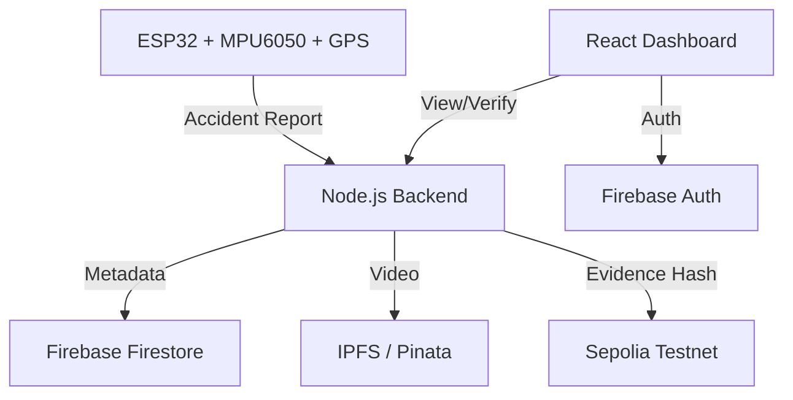

# EvidenceChain: Blockchain-Based Forensic Evidence Management

EvidenceChain is an autonomous, tamper-proof forensic evidence pipeline designed for vehicular accidents. It leverages IoT sensors for collision detection, IPFS for decentralized storage, and Ethereum-compatible blockchains for immutable evidence anchoring.

## 🚀 Key Features
- **Autonomous Detection**: ESP32 with MPU6050 accelerometer detects impacts in real-time.
- **Decentralized Storage**: Forensic video windows (60s) are hashed and uploaded to IPFS via Pinata.
- **Blockchain Anchoring**: Evidence hashes and metadata are anchored to the Sepolia Testnet for tamper-proof verification.
- **Interactive Dashboard**: Investigator dashboard for real-time tracking, accident mapping, and integrity verification.
- **Zero-Trust Security**: Firebase-powered role-based access control.

---

## 🏗️ Architecture


---

## 📋 Prerequisites
- **Node.js** (v18.x or higher)
- **Arduino IDE** (for ESP32 flashing)
- **Accounts & Keys**:
    - [Firebase](https://firebase.google.com/): Firestore & Authentication enabled.
    - [Pinata](https://www.pinata.cloud/): API Key & Secret for IPFS.
    - [Alchemy](https://www.alchemy.com/): Sepolia RPC URL.
    - [MetaMask](https://metamask.io/): With test ETH on Sepolia.

---

## 🛠️ Installation & Setup

### 1. Smart Contracts
Deploy the evidence anchoring contract:
```bash
cd contracts
npm install
# Create a .env with PRIVATE_KEY and ALCHEMY_URL
npx hardhat run scripts/deploy.js --network sepolia
```
*Note: Save the deployed contract address for the backend configuration.*

### 2. Backend Services
Setup the evidence processing server:
```bash
cd backend
npm install
```
**Configure `.env`**:
```env
PORT=5000
PINATA_API_KEY=your_key
PINATA_SECRET_API_KEY=your_secret
ALCHEMY_URL=your_rpc_url
PRIVATE_KEY=your_wallet_private_key
```
**Firebase Admin Setup**:
Place your `serviceAccountKey.json` from Firebase Console into `backend/config/`.

### 3. Frontend Dashboard
Setup the React application:
```bash
cd frontend
npm install
npm start
```

### 4. ESP32 Sensor Node
**Hardware Requirements**:
- ESP32 Development Board
- MPU6050 Accelerometer
- NEO-6M GPS Module

**Wiring**:
- **MPU6050**: SDA (GPIO 21), SCL (GPIO 22)
- **NEO-6M**: TX (GPIO 16), RX (GPIO 17)

**Libraries**:
Install via Arduino Library Manager:
- `Adafruit MPU6050`
- `TinyGPSPlus`
- `ArduinoJson`

**Configuration**:
Update `EvidenceChain_Sensor.ino` with your WiFi credentials and `SERVER_URL` (your backend IP).

---

## 🚦 Usage
1. **Start Backend**: `npm run dev` (in `/backend`).
2. **Start Frontend**: `npm start` (in `/frontend`).
3. **Connect Device**: Power up the ESP32. It will monitor for G-force spikes.
4. **Trigger Accident**: Upon impact (or manual shake), the device sends a report.
5. **Review Evidence**: Open the dashboard to view the accident map, playback the forensic video, and verify the blockchain integrity.

---

## 🛡️ License
Distributed under the ISC License. See `LICENSE` for more information.
