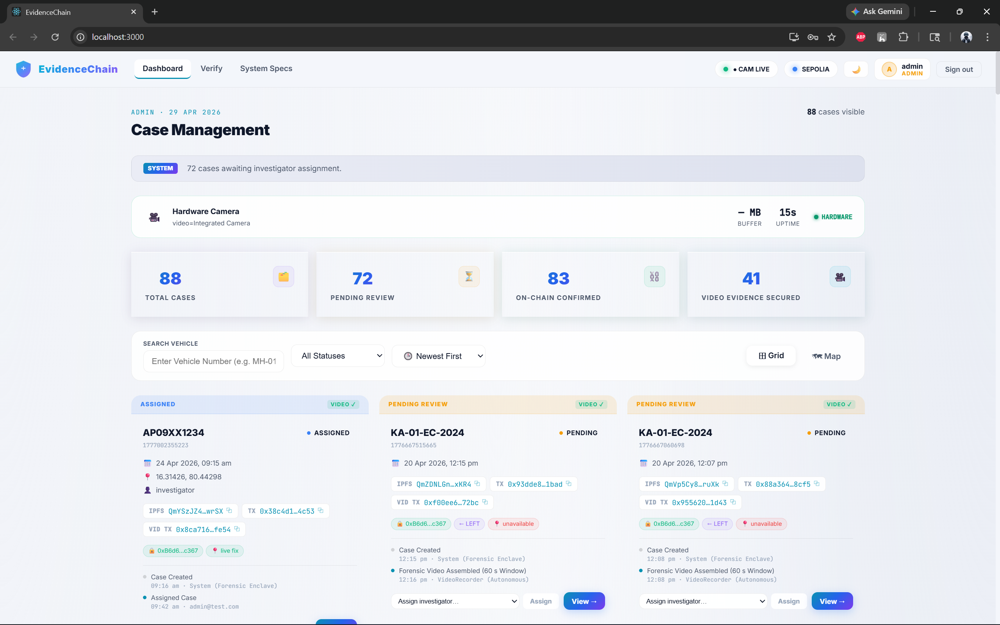
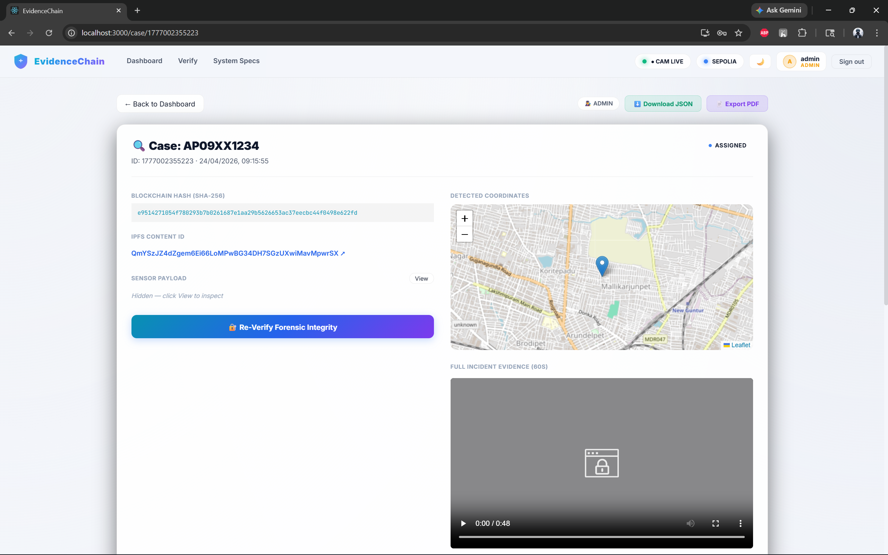
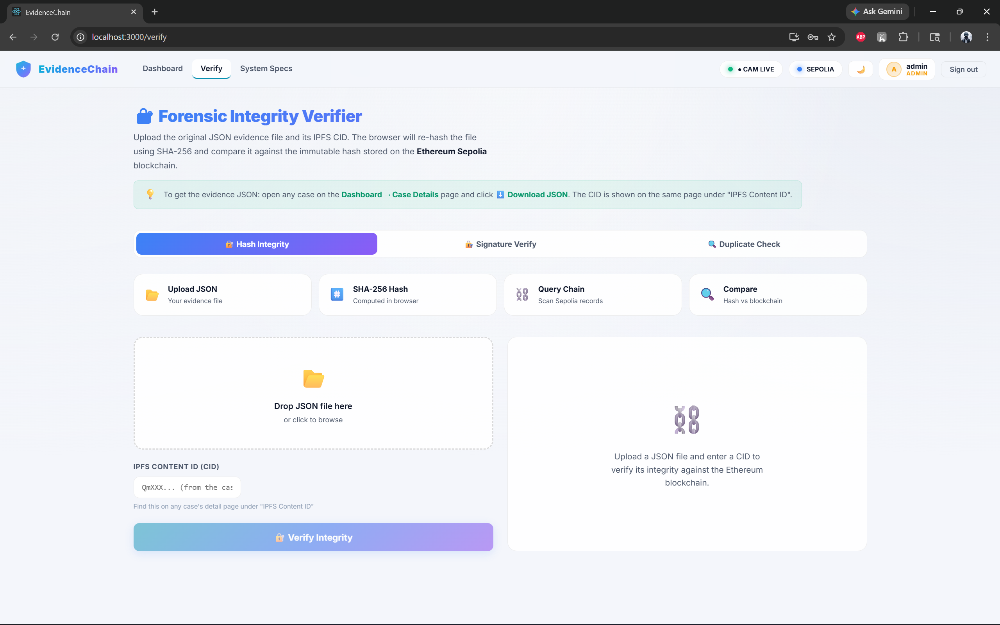
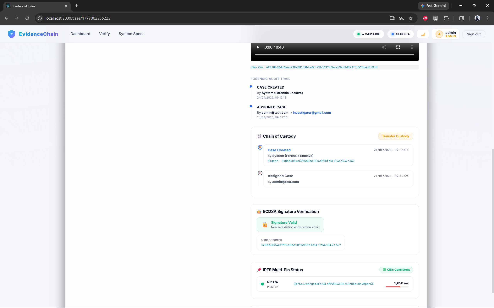
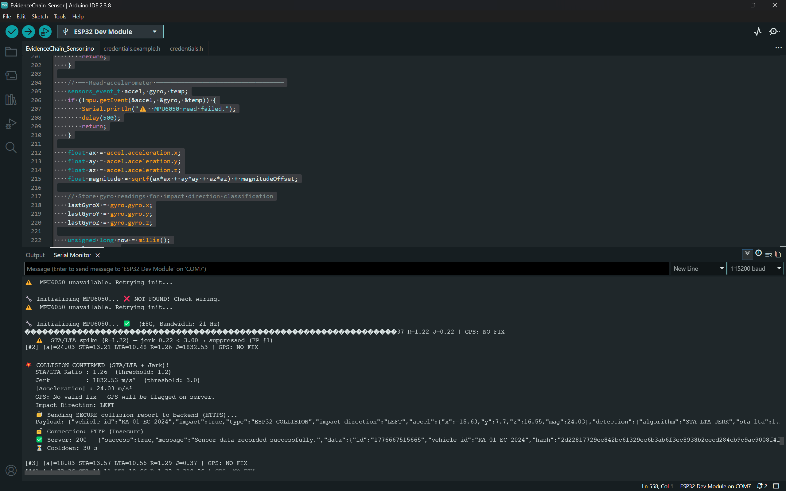
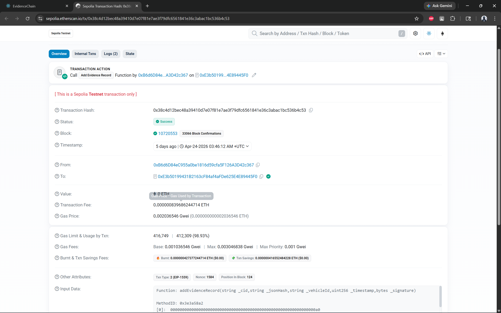

<](https://soliditylang.org/)
[](https://nodejs.org/)
[](https://react.dev/)
[](https://sepolia.etherscan.io/)
[](https://pinata.cloud/)
[](LICENSE)

**An end-to-end, tamper-proof forensic pipeline that autonomously captures vehicular accident data from IoT sensors, anchors cryptographic proofs on Ethereum, and stores evidence on IPFS — ensuring a mathematically verifiable chain of custody from impact to courtroom.**

[Getting Started](#-quick-start) · [Architecture](#-system-architecture) · [Sensor Modes](#-two-ways-to-generate-sensor-data) · [API Reference](#-api-endpoints) · [Deployment](#-deployment-guide)

</div>

---

## 📸 Screenshots

### Dashboard Overview


### Case Details & Evidence Viewer


### Cryptographic Verification Page


### Custody Timeline


### ESP32 Serial Monitor (Collision Detection)


### Etherscan Transaction Proof



---

## ✨ Key Features

| Feature | Description |
|---------|-------------|
| 🤖 **Autonomous IoT Triggering** | ESP32 with MPU6050 accelerometer uses STA/LTA algorithm to detect real collisions |
| 🌐 **Decentralized Storage** | Video & JSON evidence pinned to IPFS via Pinata — content-addressed & immutable |
| ⛓️ **Blockchain Immutability** | SHA-256 hash + IPFS CID anchored on Ethereum Sepolia via smart contract |
| 🔐 **ECDSA Non-Repudiation** | Evidence payloads are cryptographically signed; verified on-chain via `ecrecover` |
| 👥 **Role-Based Access (RBAC)** | On-chain permissions: Viewer, Investigator, Admin |
| 📋 **Chain of Custody** | Every evidence transfer is logged on-chain with full audit trail |
| 🛡️ **Replay-Attack Prevention** | Duplicate-hash detection prevents double-submission of identical events |
| 🎥 **Forensic Video Capture** | Automatic dashcam recording with ring-buffer (real camera or simulation) |

---

## 🏗️ System Architecture

```
┌─────────────────┐     HTTPS/POST      ┌──────────────────────┐
│   IoT Layer     │ ──────────────────▶  │   Backend Gateway    │
│  ESP32 + MPU6050│   (API Key Auth)     │   Node.js/Express    │
│  + NEO-6M GPS   │                      │                      │
└─────────────────┘                      │  ┌────────────────┐  │
        OR                               │  │ Forensic Pack  │  │
┌─────────────────┐     HTTP/POST        │  │ SHA-256 Hash   │  │
│ Sensor Simulator│ ──────────────────▶  │  │ ECDSA Sign     │  │
│ (Node.js script)│   (API Key Auth)     │  └───────┬────────┘  │
└─────────────────┘                      └──────────┼───────────┘
                                                    │
                                    ┌───────────────┼───────────────┐
                                    ▼                               ▼
                          ┌─────────────────┐            ┌──────────────────┐
                          │   IPFS (Pinata)  │            │ Ethereum Sepolia │
                          │  Video + JSON    │            │ Smart Contract   │
                          │  Returns CID     │            │ CID + Hash +     │
                          └────────┬────────┘             │ ECDSA Signature  │
                                   │                      └────────┬─────────┘
                                   │                               │
                                   ▼                               ▼
                          ┌────────────────────────────────────────────────┐
                          │              Frontend Dashboard                │
                          │         React 19 + Vite + Ethers.js           │
                          │  Reads from blockchain → Fetches from IPFS    │
                          │  Local signature verification + Leaflet maps  │
                          └────────────────────────────────────────────────┘
```

---

## 📂 Project Structure

```
EvidenceChain/
│
├── backend/                    # Node.js Express Gateway
│   ├── config/                 # Firebase Admin SDK config
│   │   ├── firebase.js         # Firebase initialization
│   │   └── serviceAccountKey.json  # 🔒 (you create this)
│   ├── controllers/            # Route handler logic
│   ├── evaluation/             # Research scripts (gas analysis, tamper tests)
│   ├── middleware/             # Security (CORS, Helmet, API key, Firebase Auth)
│   ├── routes/                 # Express API endpoints
│   ├── services/               # Core business logic
│   │   ├── accidentService.js  # Forensic pipeline orchestrator
│   │   ├── blockchainService.js# Ethereum TX submission (Ethers.js)
│   │   ├── ipfsService.js      # Pinata IPFS pinning
│   │   ├── signatureService.js # ECDSA signing
│   │   └── videoRecorder.js    # Ring-buffer camera recording
│   ├── utils/                  # Metrics logger, helpers
│   ├── .env                    # 🔒 Your secrets (see setup below)
│   ├── .env.example            # ✅ Template — copy this
│   ├── app.js                  # Express app (routes + middleware)
│   ├── server.js               # HTTP + HTTPS server entry point
│   └── sensorSimulator.js      # 🎮 Software collision simulator
│
├── contracts/                  # Hardhat Smart Contract Project
│   ├── contracts/
│   │   └── AccidentEvidence.sol # Solidity v2.0 (RBAC + Custody + ECDSA)
│   ├── scripts/
│   │   └── deploy.js           # Deployment script for Sepolia
│   ├── test/                   # Smart contract unit tests
│   ├── .env                    # 🔒 Your secrets (see setup below)
│   ├── .env.example            # ✅ Template — copy this
│   └── hardhat.config.js       # Hardhat network configuration
│
├── esp32/                      # IoT Hardware Firmware
│   └── EvidenceChain_Sensor/
│       ├── EvidenceChain_Sensor.ino  # Arduino C++ (STA/LTA collision detection)
│       ├── credentials.h             # 🔒 Your WiFi/API secrets (you create)
│       └── credentials.example.h     # ✅ Template — copy this
│
├── frontend/                   # React Dashboard (Vite)
│   ├── src/
│   │   ├── pages/              # Dashboard, CaseDetails, Verify, Login, Signup
│   │   ├── components/         # CaseCard, CustodyTimeline, SignatureBadge, etc.
│   │   ├── services/           # API client
│   │   ├── firebase.js         # Firebase Auth config
│   │   └── App.jsx             # Root component + routing
│   ├── .env                    # 🔒 Your API URL (see setup below)
│   ├── .env.example            # ✅ Template — copy this
│   └── vite.config.js          # Vite bundler config
│
├── data/                       # Evaluation results (gas analysis, tamper tests)
├── SECURITY_DEPLOYMENT_CHECKLIST.md
└── STRIDE_threat_model.md      # Formal threat analysis
```

---

## 🚀 Quick Start

### Prerequisites

| Tool | Version | Purpose |
|------|---------|---------|
| **Node.js** | v18+ | Backend & frontend runtime |
| **npm** | v9+ | Package management |
| **Git** | Latest | Version control |
| **MetaMask** | Browser extension | Wallet for Sepolia testnet |
| **Arduino IDE** | 2.x *(optional)* | Only if using real ESP32 hardware |

### External Accounts Needed (Free)

| Service | Sign Up URL | What You Need |
|---------|------------|---------------|
| **Alchemy** | https://alchemy.com | API key for Sepolia RPC endpoint |
| **Pinata** | https://pinata.cloud | API key + Secret for IPFS pinning |
| **Firebase** | https://console.firebase.google.com | Project for authentication |
| **Etherscan** | https://etherscan.io/apis | API key for contract verification *(optional)* |
| **Sepolia ETH** | https://sepoliafaucet.com | Free testnet ETH for gas fees |

---

## ⚙️ Environment Setup (`.env` Files)

> **There are 3 `.env` files you need to create.** Each directory has a `.env.example` template.

### 1️⃣ Backend `.env` — `backend/.env`

```bash
cd backend
cp .env.example .env
```

Then edit `backend/.env`:

```env
# ── Server Configuration ─────────────────────────────────────
NODE_ENV=development
PORT=5000
HTTPS_PORT=5443
ENABLE_HTTP=true
ALLOWED_ORIGINS=http://localhost:5173
JSON_BODY_LIMIT=128kb
API_RATE_LIMIT=120
IMPACT_RATE_LIMIT=20

# ── IoT Device Authentication ────────────────────────────────
# Generate a random key. This MUST match x-api-key header from ESP32/simulator.
IOT_API_KEYS=TEST_KEY_123

# ── Pinata (IPFS) ────────────────────────────────────────────
# Get from: https://app.pinata.cloud/developers/api-keys
PINATA_API_KEY=your_pinata_api_key
PINATA_SECRET_API_KEY=your_pinata_secret_key
PINATA_GATEWAY=https://gateway.pinata.cloud/ipfs

# ── Blockchain (Sepolia) ─────────────────────────────────────
# Alchemy: https://dashboard.alchemy.com → Create App → Sepolia
ALCHEMY_URL=https://eth-sepolia.g.alchemy.com/v2/YOUR_KEY
# MetaMask: Account Details → Export Private Key (NEVER share this!)
PRIVATE_KEY=0xYOUR_WALLET_PRIVATE_KEY
# After deploying the smart contract, paste the address here:
CONTRACT_ADDRESS=0xYOUR_DEPLOYED_CONTRACT_ADDRESS
CHAIN_ID=11155111
NETWORK_NAME=sepolia
NETWORK_MODE=testnet

# ── Camera Device (optional) ─────────────────────────────────
# Leave blank to auto-detect. Falls back to simulation if no camera.
# Windows: video=Integrated Camera   |   Linux: /dev/video0
CAMERA_DEVICE=
```

### 2️⃣ Contracts `.env` — `contracts/.env`

```bash
cd contracts
cp .env.example .env
```

Then edit `contracts/.env`:

```env
# Same Alchemy URL and Private Key as backend
ALCHEMY_URL=https://eth-sepolia.g.alchemy.com/v2/YOUR_KEY
PRIVATE_KEY=0xYOUR_WALLET_PRIVATE_KEY

# Optional: for "npx hardhat verify" on Etherscan
# Get from: https://etherscan.io/myapikey
ETHERSCAN_API_KEY=YOUR_ETHERSCAN_KEY
```

### 3️⃣ Frontend `.env` — `frontend/.env`

```bash
cd frontend
cp .env.example .env
```

Then edit `frontend/.env`:

```env
VITE_API_URL=http://localhost:5000
```

### 4️⃣ Firebase Setup

**Backend** — Download your Firebase Admin SDK service account key:
1. Go to [Firebase Console](https://console.firebase.google.com) → Your Project → ⚙️ Project Settings → **Service Accounts**
2. Click **"Generate new private key"** → download the JSON file
3. Rename it to `serviceAccountKey.json` and place it in `backend/config/serviceAccountKey.json`

**Frontend** — The Firebase client config is in `frontend/src/firebase.js`. Update the `firebaseConfig` object with your project's values from Firebase Console → Project Settings → General → Your Apps → Web App.

### 5️⃣ ESP32 Credentials *(only if using real hardware)*

```bash
cd esp32/EvidenceChain_Sensor
cp credentials.example.h credentials.h
```

Then edit `credentials.h`:

```c
#define WIFI_SSID       "YourWiFiName"
#define WIFI_PASSWORD   "YourWiFiPassword"
#define SERVER_URL      "https://192.168.x.x:5443/api/accident/report"
#define API_KEY         "TEST_KEY_123"       // Must match IOT_API_KEYS in backend
#define VEHICLE_ID      "AP09XX1234"
```

> ⚠️ **Security:** The `.gitignore` is pre-configured to exclude all `.env` files, `serviceAccountKey.json`, and `credentials.h`. **Never commit secrets.**

---

## 📦 Installation & Running

### Step 1: Clone the Repository

```bash
git clone https://github.com/sravanthbabu17/blockchain-evidence-management.git
cd blockchain-evidence-management
```

### Step 2: Deploy the Smart Contract

```bash
cd contracts
npm install
npx hardhat compile
npx hardhat run scripts/deploy.js --network sepolia
```

After deployment, copy the printed contract address and paste it into `backend/.env` as `CONTRACT_ADDRESS`.

### Step 3: Start the Backend

```bash
cd backend
npm install
npm start
```

You should see:
```
🔥 Firebase initialized successfully
🎥 Camera: recording (or simulation mode)
🚀 [HTTP]  Server running on http://localhost:5000
🔒 [HTTPS] Server running on https://localhost:5443
```

### Step 4: Start the Frontend

```bash
cd frontend
npm install
npm run dev
```

Dashboard opens at **http://localhost:5173**

### Step 5: Generate a Forensic Record

You have **two options** — see the next section.

---

## 🎮 Two Ways to Generate Sensor Data

### Option A: Software Simulation (No Hardware Needed) ✅

This is the easiest way to test the full pipeline. The simulator generates random accelerometer + GPS data, detects a simulated collision, and sends it to the backend — triggering the full forensic pipeline (video capture → IPFS → blockchain).

```bash
cd backend
node sensorSimulator.js
```

**What happens:**
1. Simulator generates random acceleration values every 3 seconds
2. When values exceed threshold (1.0 m/s²), a collision is detected
3. Payload is sent to `POST http://localhost:5000/api/accident/report` with API key
4. Backend captures video, pins evidence to IPFS, signs with ECDSA, anchors on blockchain
5. Simulator exits after one successful report

**Expected output:**
```
🚀 SENSOR SIMULATOR ACTIVE (Mode: Single-Shot)
📊 Threshold: 1.0 | Interval: 3s
--------------------------------------------------
[10:30:01] Monitoring sensors...
💥 REAL COLLISION DETECTED!
📤 Sending Forensics...
✅ Forensic Record Secured: 0xabc123...
🏁 Mission Complete. Forensic evidence secured.
```

### Option B: Real ESP32 Hardware 🔧

For actual IoT deployment using physical sensors.

**Hardware Required:**
| Component | Model | Purpose |
|-----------|-------|---------|
| Microcontroller | ESP32 (30/38-pin) | Main controller |
| Accelerometer/Gyro | MPU6050 | Collision detection (STA/LTA algorithm) |
| GPS Module | NEO-6M | Location tracking |

**Wiring Diagram:**
```
MPU6050 (I2C):           NEO-6M GPS (UART):
  VCC  → 3.3V             VCC → 3.3V (or 5V via VIN)
  GND  → GND              GND → GND
  SDA  → GPIO 21          TX  → GPIO 16 (ESP32 RX2)
  SCL  → GPIO 22          RX  → GPIO 17 (ESP32 TX2)
  AD0  → GND
```

**Arduino IDE Setup:**
1. Install ESP32 board support: `https://dl.espressif.com/dl/package_esp32_index.json`
2. Install libraries via Library Manager:
   - `Adafruit MPU6050`
   - `Adafruit Unified Sensor`
   - `TinyGPSPlus`
   - `ArduinoJson` (v6.x)
3. Create `credentials.h` (see [ESP32 Credentials](#5️⃣-esp32-credentials-only-if-using-real-hardware) above)
4. Open `esp32/EvidenceChain_Sensor/EvidenceChain_Sensor.ino`
5. Select board: **ESP32 Dev Module**
6. Upload and open Serial Monitor (115200 baud)

**Detection Algorithm:** Dual-condition STA/LTA (Short-Term Average / Long-Term Average) ratio + jerk threshold. Based on seismological detection methods adapted for vehicular impacts.

---

## 🔌 API Endpoints

| Method | Endpoint | Auth | Description |
|--------|----------|------|-------------|
| `POST` | `/api/accident/report` | API Key (`x-api-key`) | Receives IoT telemetry, triggers forensic pipeline |
| `GET` | `/api/verify/list` | Firebase Token | Returns all blockchain-anchored cases |
| `GET` | `/api/verify/record/:index` | Firebase Token | Detailed data for a specific case |
| `POST` | `/api/custody/event` | Firebase Token (Investigator+) | Logs chain-of-custody event on-chain |
| `GET` | `/api/camera/status` | Firebase Token | Camera recording mode (real/simulation) |
| `GET` | `/api/metrics` | Firebase Token (Admin) | Pipeline latency statistics |
| `GET` | `/api/metrics/raw` | Firebase Token (Admin) | Raw per-case traces for CSV export |
| `GET` | `/` | None | Health check |

---

## 🔐 Smart Contract

**Contract:** `AccidentEvidence.sol` v2.0 — Deployed on Sepolia  
**Address:** [`0xE3b50199431B2163cF84af4aFDe625E4E89445F0`](https://sepolia.etherscan.io/address/0xE3b50199431B2163cF84af4aFDe625E4E89445F0)

| Function | Description |
|----------|-------------|
| `addEvidenceRecord()` | Anchors CID + SHA-256 hash, verifies ECDSA signature |
| `logCustodyEvent()` | Logs custody status change on-chain |
| `transferCustody()` | Transfers active custodian of a record |
| `grantRole()` / `revokeRole()` | Manages RBAC (Viewer=1, Investigator=2, Admin=3) |

**Events:** `RecordAdded`, `CustodyEvent`, `DuplicateHashWarning`, `RoleGranted`

---

## 🚢 Deployment Guide

### Should You Deploy?

| Scenario | Recommendation |
|----------|---------------|
| **Academic demo / portfolio** | ✅ Yes — deploy frontend to Vercel, keep backend local |
| **Live demo for reviewers** | ✅ Yes — deploy both frontend + backend |
| **Production use** | ⚠️ Not yet — needs mainnet, encryption, audit (see Limitations) |

### Frontend Deployment (Vercel — Free) ✅ Recommended

```bash
cd frontend
npm run build
```

1. Push your repo to GitHub
2. Go to [vercel.com](https://vercel.com) → Import your GitHub repo
3. Set framework preset to **Vite**
4. Add environment variable: `VITE_API_URL` = your backend URL
5. Deploy!

### Backend Deployment (Render — Free Tier)

1. Go to [render.com](https://render.com) → New Web Service
2. Connect your GitHub repo, set root directory to `backend`
3. Build command: `npm install`
4. Start command: `node server.js`
5. Add all environment variables from `backend/.env`
6. Update `ALLOWED_ORIGINS` to include your Vercel frontend URL
7. Update frontend's `VITE_API_URL` to the Render URL

### Alternative Backend Options

| Platform | Free Tier | Notes |
|----------|-----------|-------|
| **Render** | 750 hrs/month | Spins down after inactivity |
| **Railway** | $5 credit/month | Easy deploy, persistent |
| **Fly.io** | 3 shared VMs | Good for always-on |
| **AWS EC2** | 12 months free (t2.micro) | Full control, more setup |

> **Note:** The smart contract is already deployed on Sepolia — no additional blockchain deployment needed unless you redeploy a new contract version.

---

## 🧪 Testing & Evaluation

```bash
# Smart contract tests
cd contracts
npm test

# Gas analysis (research paper data)
cd backend/evaluation
node gasAnalysis.js

# Tamper detection test
node tamperTest.js
```

---

## 🛠️ Tech Stack

| Layer | Technologies |
|-------|-------------|
| **IoT** | C++ / Arduino, ESP32, MPU6050, NEO-6M GPS |
| **Backend** | Node.js, Express 5, Ethers.js v6, Firebase Admin |
| **Storage** | IPFS via Pinata API |
| **Blockchain** | Solidity 0.8.20, Hardhat 3, Ethereum Sepolia, Alchemy RPC |
| **Frontend** | React 19, Vite 8, React Router 7, Leaflet, Lucide Icons |
| **Security** | ECDSA, SHA-256, Helmet, CORS, Firebase Auth, RBAC |

---

## ⚠️ Limitations

- **Testnet Only** — Uses Sepolia testnet. Production needs mainnet or L2 (Arbitrum/Optimism)
- **Public IPFS Data** — Evidence on IPFS is public (obfuscated by CID). Production needs payload encryption
- **Simulated Video** — Camera falls back to simulation mode when no physical camera is available
- **GPS Indoors** — NEO-6M GPS requires outdoor line-of-sight for satellite fix

## 🔮 Future Improvements

- **Payload Encryption** — AES-256 or Lit Protocol for encrypted IPFS storage
- **Layer 2 Scaling** — Polygon/Arbitrum for sub-second finality and lower gas
- **Zero-Knowledge Proofs** — zk-SNARKs to prove speed thresholds without revealing identity
- **Mobile App** — React Native companion for field investigators

---

## 📄 License

This project is part of an academic research submission. See [LICENSE](LICENSE) for details.

---

<div align="center">

**EvidenceChain** — *A mathematically verifiable approach to forensic truth.*

Built with ⛓️ by [Sravanth Babu](https://github.com/sravanthbabu17)

</div>
]]>
